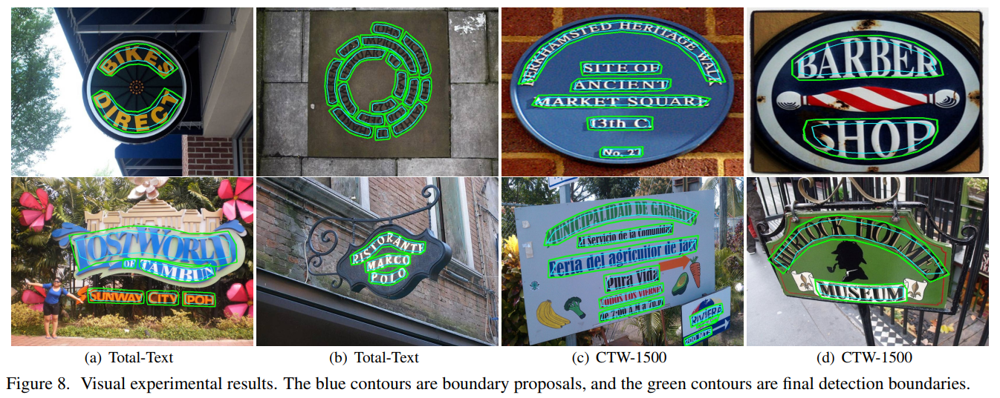
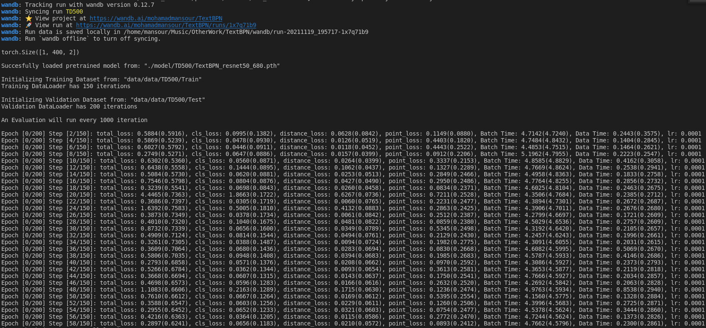
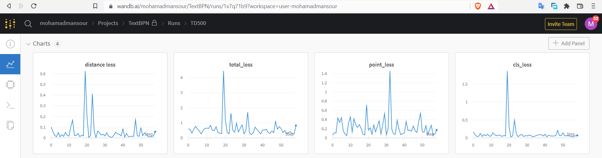

This is an **UNOFFICIAL** repo for the TextBPN (ICCV2021).  

For the Original repo visit the following [URL](https://github.com/GXYM/TextBPN/tree/225844770e0107817be9fb86d53f873fa3eb07ae)

The original repo *lacks the training code* for now

Main Contributions: Training code, Config Support, Colab Notebook

[](https://colab.research.google.com/github/mohamadmansourX/TextBPN-Training/blob/main/TextBPN_Training.ipynb)
# TextBPN-Training

A training extention for the paper: Adaptive Boundary Proposal Network for Arbitrary Shape Text Detection.

**Mainly** this extension provides a training script for the TextBPN model - [my_train_model.py](https://github.com/mohamadmansourX/TextBPN-Training/blob/main/my_train_model.py)



# Contents
- [Original Repo](#original-repo)
- [My Contribution](#my-contribution)
- [Prerequisites](#prerequisites)
- [Dataset Links](#dataset-links)
- [Models](#models)
- [Training](#training)
- [Evaluation](#evaluation)
- [Final Note](#final-note)


## [Original Repo](https://github.com/GXYM/TextBPN/tree/225844770e0107817be9fb86d53f873fa3eb07ae):
The Original Repository complete code (**training**) is ***not*** currently available and will be released in TextBPN V2. [Issue](https://github.com/GXYM/TextBPN/issues/3#issuecomment-969966908)

## My Contribution
Meanwhile and until the release of TextBPN V2 source code, I developed a training extention for the TextBPN with a [Config File](https://github.com/mohamadmansourX/TextBPN-Training/blob/main/cfglib/Config.yml) support.
All you have to do is play with the Config file and run the following script:
```
python my_train_model.py
```

Wandb is suported as well incase anyone interested in the emerging ML dashboard. 

All you have to do is to enable it in the [config file under "Wandb" section](https://github.com/mohamadmansourX/TextBPN-Training/blob/eb958af28e10ee53af06f8b7e0cad49c82bf057b/cfglib/Config.yml#L60).


#### TODO List
- [x] Training; Added training scripts for both *pretrained* and *from scratch* model. 
- [x] [Configuration](https://github.com/mohamadmansourX/TextBPN-Training/blob/eb958af28e10ee53af06f8b7e0cad49c82bf057b/cfglib/Config.yml) file to easily customize things
- [x] Wandb API Support (Just add enable it in the [Config file](https://github.com/mohamadmansourX/TextBPN-Training/blob/eb958af28e10ee53af06f8b7e0cad49c82bf057b/cfglib/Config.yml#L60).
- [ ] Add more options for checkpoints managment
- [ ] Add more options for the Config File

*Note*: Their is a a small error in the validation step. I'll be fixing it soon.

## Prerequisites:
*GPU Inference:*
```text
  python 3.9;  
  PyTorch 1.7.0;   
  Numpy >=1.2.0   
  CUDA 11.1;  
  GCC >=10.0;   
  NVIDIA GPU(with 11G or larger GPU memory for inference);
```
*Non-GPU Inference:*

1- Skip the above GPU-related requirments

2- Make sure to have good RAMs

3- Set the Config `use_gpu` to False

and your can run the inference using CPU

## Dataset Links  
1. [CTW1500](https://drive.google.com/file/d/1A2s3FonXq4dHhD64A2NCWc8NQWMH2NFR/view?usp=sharing)   
2. [TD500](https://drive.google.com/file/d/1ByluLnyd8-Ltjo9AC-1m7omZnI-FA1u0/view?usp=sharing)  
3. [Total-Text](https://drive.google.com/file/d/17_7T_-2Bu3KSSg2OkXeCxj97TBsjvueC/view?usp=sharing) 

## Models
 *  [Total-Text model](https://drive.google.com/file/d/13ZrWfpv2dJqdv0cDf-hE0n5JQegNY0-i/view?usp=sharing) (pretrained on ICDAR2017-MLT)
 *  [CTW-1500 model](https://drive.google.com/file/d/13ZrWfpv2dJqdv0cDf-hE0n5JQegNY0-i/view?usp=sharing) (pretrained on ICDAR2017-MLT)
 *  [MSRA-TD500 model](https://drive.google.com/file/d/13ZrWfpv2dJqdv0cDf-hE0n5JQegNY0-i/view?usp=sharing) (pretrained on ICDAR2017-MLT)  

## Training

### Configuration Settings:
Change the [Config file](https://github.com/mohamadmansourX/TextBPN-Training/blob/eb958af28e10ee53af06f8b7e0cad49c82bf057b/cfglib/Config.yml) as needed.

### Training:

run:
```
python my_train_model.py
```

#### Few steps demo using pretrained checkpoint (ICCV2021_model/TD500/TextBPN_resnet50_680.pth)
Terminal Logs:




Wandb:




## Evaluation
run:  
```
sh eval.sh
```
 
## Final Note

Due to the high requirments of this github project (GPU 11GB+), my experiments were done using "cpu" device;

<sup> which is now made easy by just setting **"use_gpu"** to False using the Config file :). </sup>
